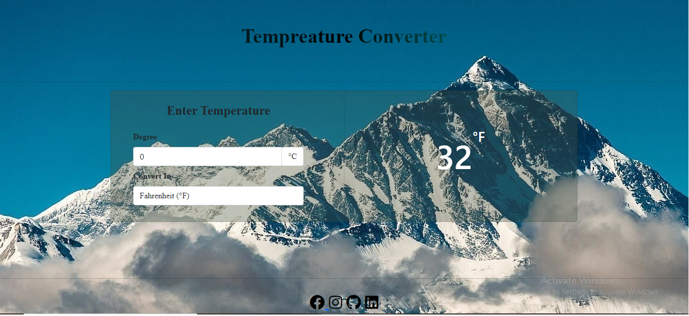

# Temperature-Converter
"Temperature-Converter" project built with HTML5, CSS3, JavaScript.It'sa simple Website which converts temperature unit of celcius to Fahrenheit, Kelvin.

# Screenshot
You can view the project by clicking on the demo Button.

       

